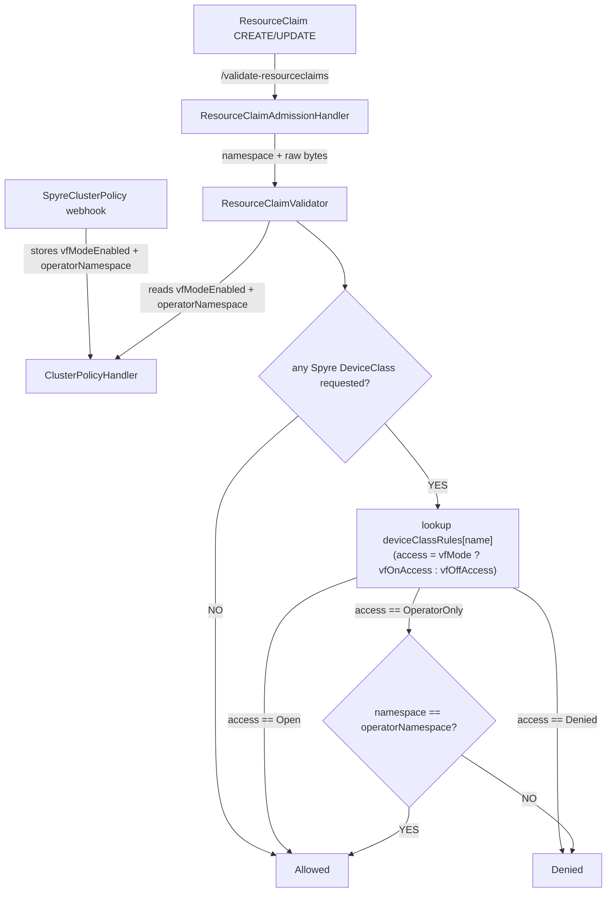

# DRA ResourceClaim Validation Plan

## Architecture Diagram



Note: this replaces a "branch on VF mode, then branch on DeviceClass" nested
structure (two near-duplicate switch arms) with a single flat rule table keyed
by DeviceClass name, each entry holding its VF-mode-ON and VF-mode-OFF access
level. This removes the duplicated branching and the risk of an allow/deny
value getting swapped between the two arms during edits.

## Overview

Add a new validating webhook for `ResourceClaim` resources (`resource.k8s.io/v1beta2`)
that enforces namespace-based access control on Spyre DeviceClasses depending on
whether VF mode is active.

### VF Mode Detection

VF mode is active when `SpyreClusterPolicy.spec.cardManagement.enabled == true`.

### Validation Rules

| DeviceClass | VF mode ON | VF mode OFF |
|---|---|---|
| `spyre-pf` | allowed only in spyre-operator namespace | allowed for everyone |
| `spyre-privileged-vf` | allowed only in spyre-operator namespace | denied for everyone |
| `spyre-standard-vf` | allowed for everyone | denied for everyone |

- The spyre-operator namespace is read dynamically from
  `SpyreClusterPolicy.status.namespace` and cached in `ClusterPolicyHandler`.
- Both `spec.devices.requests[].exactly.deviceClassName` and
  `spec.devices.requests[].firstAvailable[].deviceClassName` are checked.

### Target Resource

`ResourceClaim` (`resource.k8s.io/v1beta2`)

---

## Sub-Tasks

### Sub-Task 1: Add VF mode flag and operator namespace cache to ClusterPolicyHandler

**Status:** [ ] pending

**Intent:**
When `ClusterPolicyHandler` processes a `SpyreClusterPolicy`, store
`spec.cardManagement.enabled` as a `vfModeEnabled` atomic flag and
`status.namespace` as an `operatorNamespace` atomic value.
Follow the same pattern used by the existing `schedulerEnabled atomic.Bool`.

**Expected Outcomes:**
- `ClusterPolicyHandler` gains a `vfModeEnabled atomic.Bool` field.
- `ClusterPolicyHandler` gains an `operatorNamespace atomic.Value` field.
- Both fields are updated inside `validate()` when a `SpyreClusterPolicy` is processed.

**Todo List:**
1. Add `vfModeEnabled atomic.Bool` to the `ClusterPolicyHandler` struct.
2. Add `operatorNamespace atomic.Value` to the `ClusterPolicyHandler` struct.
3. In `validate()`, call `v.vfModeEnabled.Store(clusterPolicy.Spec.CardManagement.Enabled)`.
4. In `validate()`, call `v.operatorNamespace.Store(clusterPolicy.Status.Namespace)`.

**Relevant Context:**
- [`pkg/validator/clusterpolicy.go`](pkg/validator/clusterpolicy.go) — `ClusterPolicyHandler` struct and `validate()`
- Existing `schedulerEnabled atomic.Bool` pattern is the reference implementation.

---

### Sub-Task 2: Implement ResourceClaimValidator

**Status:** [ ] pending

**Intent:**
Create a new validator that decodes a `ResourceClaim`, collects all DeviceClass
names from every `DeviceRequest` (`exactly.deviceClassName` and
`firstAvailable[].deviceClassName`), and enforces the VF mode rules per DeviceClass.

**Expected Outcomes:**
- `pkg/validator/resourceclaim.go` is created.
- `ResourceClaimValidator` struct embeds `*ClusterPolicyHandler`.
- `Validate(namespace string, raw []byte) error` is implemented.
- DeviceClass name constants are defined:
  - `DeviceClassSpyrePF = "spyre-pf"`
  - `DeviceClassSpyrePrivilegedVF = "spyre-privileged-vf"`
  - `DeviceClassSpyreStandardVF = "spyre-standard-vf"`
- New errors are added to `pkg/validator/error.go`:
  - `ErrSpyrePFRestrictedToOperatorNamespace`
  - `ErrPrivilegedVFRestrictedToOperatorNamespace`
  - `ErrPrivilegedVFNotAllowedInNonVFMode`
  - `ErrStandardVFNotAllowedInNonVFMode`

**Validation Logic:**

Instead of nesting "branch on VF mode, then branch on DeviceClass" (two
near-duplicate switch arms, easy to swap an allow/deny between them), the
rule for every DeviceClass is expressed once as a flat table of two access
levels — one for VF mode ON, one for VF mode OFF:

```
type accessLevel int

const (
    accessOpen accessLevel = iota // claimable by any namespace
    accessOperatorOnly            // claimable only by the operator namespace
    accessDenied                  // claimable by no one
)

type deviceClassRule struct {
    vfOnAccess  accessLevel
    vfOffAccess accessLevel
}

var deviceClassRules = map[string]deviceClassRule{
    DeviceClassSpyrePF:           {vfOnAccess: accessOperatorOnly, vfOffAccess: accessOpen},
    DeviceClassSpyrePrivilegedVF: {vfOnAccess: accessOperatorOnly, vfOffAccess: accessDenied},
    DeviceClassSpyreStandardVF:   {vfOnAccess: accessOpen, vfOffAccess: accessDenied},
}
```

`validateDeviceClassName` looks the name up once; if it isn't a Spyre-managed
class it is ignored (always allowed). Otherwise it picks `vfOnAccess` or
`vfOffAccess` depending on `vfMode`, then applies exactly one rule for that
access level (`accessOpen` → allow, `accessDenied` → deny, `accessOperatorOnly`
→ allow iff `namespace == operatorNamespace`). There is only one place that
decides allow/deny per access level, so the four error constants are chosen
by (DeviceClass name, which access level triggered the denial) rather than by
which of two duplicated switch arms was hit.

**Todo List:**
1. Add the four error variables to `pkg/validator/error.go`.
2. Create `pkg/validator/resourceclaim.go`.
3. Define the three DeviceClass name constants and the `accessLevel` type
   (`accessOpen`, `accessOperatorOnly`, `accessDenied`).
4. Define the `deviceClassRules` map shown above.
5. Implement `ResourceClaimValidator` struct and `NewResourceClaimValidator()`.
6. Implement `Validate(namespace string, raw []byte) error`:
   - Unmarshal into `resourcev1beta2.ResourceClaim`.
   - Collect all DeviceClass names (see step 7).
   - Apply the rule for each name (see step 8).
7. Implement a helper `collectDeviceClassNames(claim) []string` that extracts
   `exactly.deviceClassName` and every `firstAvailable[].deviceClassName`.
8. Implement `validateDeviceClassName(name, namespace string, vfMode bool, operatorNS string) error`:
   - Look up `name` in `deviceClassRules`; if absent, return `nil`.
   - Select `vfOnAccess`/`vfOffAccess` based on `vfMode`.
   - Switch on the selected access level and return `nil` or the matching
     sentinel error.

**Relevant Context:**
- [`vendor/k8s.io/api/resource/v1beta2/types.go`](vendor/k8s.io/api/resource/v1beta2/types.go) — `ResourceClaim`, `DeviceRequest`, `ExactDeviceRequest`, `DeviceSubRequest`
- [`pkg/validator/clusterpolicy.go`](pkg/validator/clusterpolicy.go) — `ClusterPolicyHandler` (after Sub-Task 1)
- [`pkg/validator/error.go`](pkg/validator/error.go) — error constants

---

### Sub-Task 3: Add ResourceClaimAdmissionHandler

**Status:** [ ] pending

**Intent:**
The existing `AdmissionHandler` passes only `raw []byte` to its `Validator`.
`ResourceClaimValidator` also needs the request namespace (`admission.Request.Namespace`).
Introduce a dedicated `ResourceClaimAdmissionHandler` that forwards the namespace,
leaving all existing validators untouched.

**Expected Outcomes:**
- `ResourceClaimAdmissionHandler` is added to `pkg/validator/validator.go`.
- Its `Handle()` method extracts `request.Namespace` and calls
  `ResourceClaimValidator.Validate(namespace, raw)`.
- No changes are made to the existing `AdmissionHandler` or `Validator` interface.

**Todo List:**
1. Add `ResourceClaimAdmissionHandler` struct (holding `*ResourceClaimValidator`) to
   `pkg/validator/validator.go`.
2. Implement `Handle(ctx, admission.Request) admission.Response` on it.

**Relevant Context:**
- [`pkg/validator/validator.go`](pkg/validator/validator.go) — existing `AdmissionHandler`
- [`main.go`](main.go) — webhook handler registration

---

### Sub-Task 4: Register the new webhook endpoint in main.go

**Status:** [ ] pending

**Intent:**
Expose `/validate-resourceclaims` so Kubernetes can route `ResourceClaim`
admission requests to the new handler.

**Expected Outcomes:**
- A `/validate-resourceclaims` endpoint is registered in `main.go`.

**Todo List:**
1. Add `resourceClaimValidator` and `resourceClaimHandler` variables in `main.go`.
2. Call `hookServer.Register("/validate-resourceclaims", ...)` with the new handler.

**Relevant Context:**
- [`main.go`](main.go) — existing four endpoint registrations

---

### Sub-Task 5: Add unit tests

**Status:** [ ] pending

**Intent:**
Verify all validation rules through unit tests.

**Expected Outcomes:**
- `pkg/validator/resourceclaim_test.go` is created.
- The following cases are covered:
  - VF mode ON + spyre-operator namespace → `spyre-pf` and `spyre-privileged-vf` allowed
  - VF mode ON + general namespace → `spyre-pf` and `spyre-privileged-vf` denied
  - VF mode ON → `spyre-standard-vf` denied
  - VF mode OFF → `spyre-pf` allowed
  - VF mode OFF → `spyre-privileged-vf` denied
  - VF mode OFF → `spyre-standard-vf` denied
  - `firstAvailable` containing a restricted class → denied
  - Non-Spyre DeviceClass → allowed (ignored)

**Todo List:**
1. Create `pkg/validator/resourceclaim_test.go`.
2. Implement test cases following the pattern in `pkg/validator/pod_test.go`.

**Relevant Context:**
- [`pkg/validator/pod_test.go`](pkg/validator/pod_test.go) — existing test patterns
- [`pkg/validator/validator_suite_test.go`](pkg/validator/validator_suite_test.go) — Ginkgo suite setup
